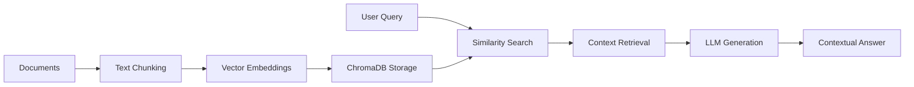

# RAG-Based AI Assistant

A Retrieval-Augmented Generation (RAG) system that answers questions based on uploaded documents using vector search and large language models.

**Module 1 Project** - Agentic AI Developer Certification Program

## Overview

This project implements a complete RAG pipeline that combines the power of semantic search with generative AI to provide accurate, context-aware responses based on your document corpus.

### Core Pipeline



## Features

- **Multi-format document support**: .txt, .pdf, .docx
- **Vector-based semantic search**: ChromaDB with persistent storage
- **Multiple LLM providers**: OpenAI GPT, Groq Llama, Google Gemini
- **Flexible embeddings**: Sentence Transformers (all-MiniLM-L6-v2)
- **Interactive CLI**: Question-answering interface

## Technology Stack

- **Framework**: LangChain
- **Vector Database**: ChromaDB
- **Embeddings**: Sentence Transformers
- **LLM Providers**: OpenAI / Groq / Google Gemini
- **Document Processing**: PyPDF2, python-docx

## Prerequisites

- Python 3.8 or higher
- API key from at least one provider:
  - [OpenAI](https://platform.openai.com/api-keys)
  - [Groq](https://console.groq.com/keys) (recommended - free tier available)
  - [Google AI](https://aistudio.google.com/app/apikey)

## Installation

### 1. Clone the repository
```bash
git clone https://github.com/Virgi-niawamaitha/RAG-based-AI-assistant-project.git
cd RAG-based-AI-assistant-project
```

### 2. Create virtual environment
```bash
python -m venv venv

# Windows
venv\Scripts\activate

# macOS/Linux
source venv/bin/activate
```

### 3. Install dependencies
```bash
pip install -r requirements.txt
```

### 4. Configure API keys
Create a .env file in the project root:
```bash
cp .env.example .env
```

Edit .env and add your API key:
```env
OPENAI_API_KEY=your_key_here
GROQ_API_KEY=your_key_here
GOOGLE_API_KEY=your_key_here
```


## Usage

### Running the Assistant
From the project root directory:
```bash
python src/app.py
```

### Adding Documents
Place your documents in the data/ directory:
```
data/
├── txt/
│   ├── document1.txt
│   └── document2.txt
├── pdf/
│   ├── research_paper.pdf
│   └── manual.pdf
└── docx/
    ├── notes.docx
    └── report.docx
```
The system will automatically load, chunk, and embed all supported files.

### Example Queries
```
Your question: What is climate science?
Your question: Explain machine learning types
Your question: quit
```

## Architecture

### System Components

```
┌─────────────────┐    ┌──────────────────┐    ┌─────────────────┐
│   Document      │    │   Text Chunking  │    │   Embedding     │
│   Loader        │───▶│   & Processing   │───▶│   Generation    │
└─────────────────┘    └──────────────────┘    └─────────────────┘
                                                         │
┌─────────────────┐    ┌──────────────────┐    ┌─────────────────┐
│   Response      │    │   LLM           │    │   ChromaDB      │
│   Generation    │◀───│   Processing     │◀───│   Vector Store  │
└─────────────────┘    └──────────────────┘    └─────────────────┘
                                ▲                        │
                                │                        ▼
                       ┌──────────────────┐    ┌─────────────────┐
                       │   Query          │    │   Similarity    │
                       │   Processing     │───▶│   Search        │
                       └──────────────────┘    └─────────────────┘
```

### Processing Pipeline

1. **Document Loading**: Reads .txt, .pdf, .docx files from data/ directory
2. **Text Chunking**: Splits documents using RecursiveCharacterTextSplitter (500 chars, 50 overlap)
3. **Embedding**: Converts chunks to vectors using Sentence Transformers
4. **Storage**: Persists embeddings in ChromaDB
5. **Retrieval**: Finds top-k similar chunks for user queries
6. **Generation**: LLM generates contextual answer using retrieved chunks

## Project Structure

```
RAG-based-AI-assistant-project/
├── src/
│   ├── app.py              # Main application and RAG pipeline
│   └── vectordb.py         # Vector database wrapper
├── data/                   # Place your documents here
│   ├── txt/               # Plain text documents
│   ├── pdf/               # PDF documents
│   └── docx/              # Word documents
├── chroma_db/             # ChromaDB persistent storage
├── .env.example           # Environment variables template
├── .gitignore             # Git ignore rules
├── requirements.txt       # Python dependencies
├── LICENSE               # MIT License
└── README.md            # This file
```

## Known Limitations

1. **Stateless queries**: Each question is processed independently without conversation history. For best results, include full context in each query.
2. **Query specificity**: More specific queries yield better results. Vector search works on semantic similarity.
    - **Good**: "What are the applications of artificial intelligence?"
    - **Less effective**: "Tell me more about it" (no context from previous query)
3. **Document scope**: Answers are limited to information in uploaded documents. The system will explicitly state when information is unavailable.

## Technologies

- **LangChain** - LLM application framework
- **ChromaDB** - Vector database
- **Sentence Transformers** - Text embeddings
- **Groq** - Fast LLM inference

## License

This project is licensed under the MIT License - see the LICENSE file for details.

## Acknowledgments

Developed as part of the Ready Tensor Agentic AI Developer Certification Program - Module 1.